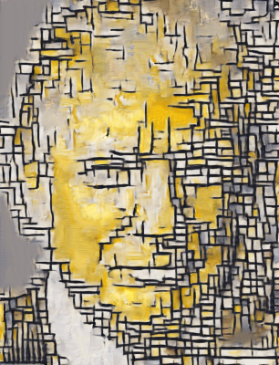

# Efficient-GPNN
An efficient Pytorch implementation of GPNN as depicted in ["Drop the GAN: In Defense of Patches Nearest Neighbors as Single Image Generative Models"](https://arxiv.org/abs/2103.15545)

This is the version of GPNN I used to compare with my model in the reaserach done for writing the paper
["Generating Natural Images with Direct Patch Distribution Matching"](https://arxiv.org/abs/2203.11862)
. The code for my paper is here https://github.com/ariel415el/GPDM.

While writing this implementation I consulted the implementation in https://github.com/iyttor/GPNN.git.
My implementation offers more simplicity, a faster pytorch computation of the NN matrix and a low memory version of the computation done in O(N+M) as 
suggested in the suplementary of the paper: https://www.wisdom.weizmann.ac.il/~vision/gpnn/.

I've also implemented approximated NN with Faiss (cpu/gpu) with various indices like IVF and IVFPQ.


# NN computation options
- Pytorch : Batched Fast pytorch nn computations

  `NN_module = PytorchNN(alpha, batch_size, use_gpu=True)`

- Pytorch_low_memory: Batched Efficient pytorch implementation that avoids holding a distance matrix on memory

  `NN_module = PytorchNNLowMemory(alpha, batch_size, use_gpu=True)`

- FaissFlat: uses faiss exact-NN computations (Cpu and GPU, no alpha)

  `NN_module = FaissFlat(use_gpu=True)`

- FaissIVF: uses faiss inverted index approximate-nn (Cpu and GPU, no alpha)

  `NN_module = FaissIVF(use_gpu=True)`

- FaissIVFPQ: uses faiss inverted index with product quantization approximate-nn (Cpu and GPU, no alpha)
  
  `NN_module = FaissIVFPQ(use_gpu=True)`


# How to run
### Image reshuffling
`$ python3 main.py images/SIGD16/12.jpg`

| Input                                                   | Output                                                      |
|---------------------------------------------------------|-------------------------------------------------------------| 
|  | |  


### Image Retargeting
`$ python3 main.py images/SIGD16/8.jpg --init_from target --width_factor 1.5

| Input                                                   | Output                                                             |
|---------------------------------------------------------|--------------------------------------------------------------------| 
|   |  |  

### Image style transfer
`$ python3 main.py images/style_transfer/mondrian.jpg --init_from images/style_transfer/trump.jpg --noise_sigma 0 --fine_dim 400 --coarse_dim 200`

| Input                                                        | init_from                                                 | Output                                                     |
|--------------------------------------------------------------|-----------------------------------------------------------|------------------------------------------------------------| 
|  |  |  |  

# Cites
```
@inproceedings{granot2022drop,
  title={Drop the gan: In defense of patches nearest neighbors as single image generative models},
  author={Granot, Niv and Feinstein, Ben and Shocher, Assaf and Bagon, Shai and Irani, Michal},
  booktitle={Proceedings of the IEEE/CVF Conference on Computer Vision and Pattern Recognition},
  pages={13460--13469},
  year={2022}
}
```

